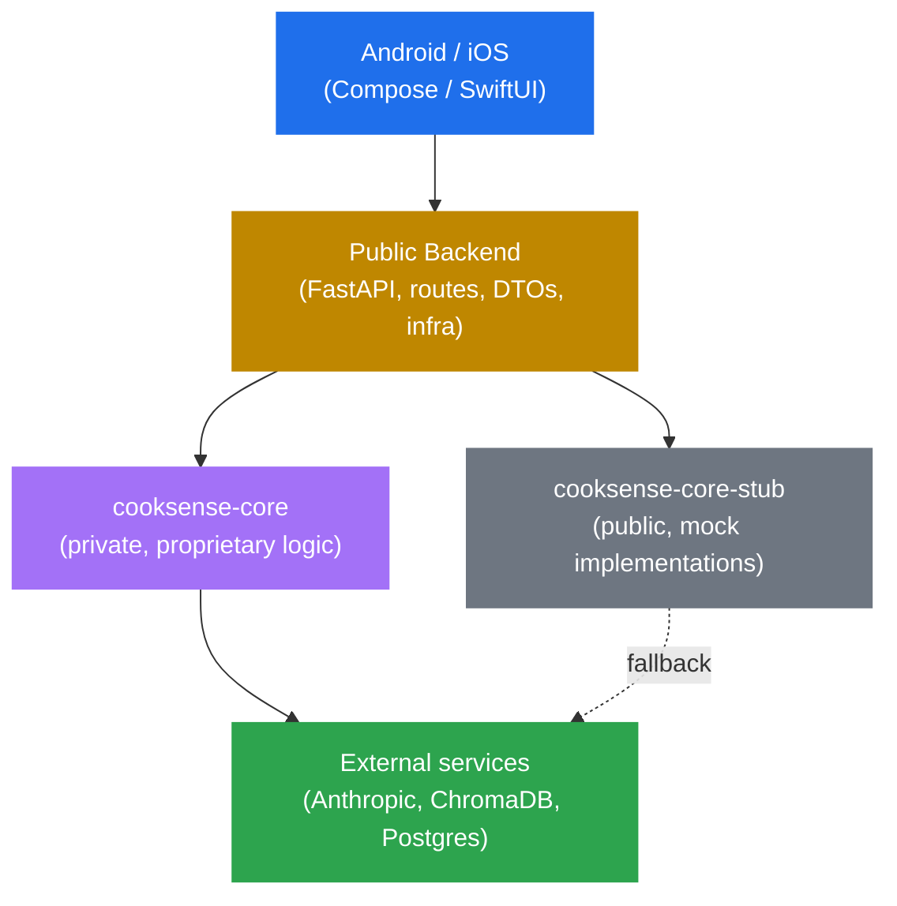

# cooksense

A mobile app that turns a photo of your pantry into recipes you can actually make, personalized to how you eat. Built end-to-end as a portfolio piece demonstrating Mobile + Computer Vision + RAG + LLM integration. Every behavior is driven by tests; the architecture separates open code from proprietary product logic by design.

**Status: work in progress.** Phase 0 (project setup) is the next milestone. Six phases planned: setup, RAG foundation, vision pipeline, meal planning, mobile app, polish.

## What this demonstrates

- Mobile + AI integration end-to-end: Android (Kotlin + Compose) consuming a Python FastAPI backend that wraps Claude Vision and a RAG pipeline over a recipe corpus
- Open Core architecture: public repo with mobile + backend shell + functional stub; private repo with proprietary ranking, prompt engineering, and retrieval logic
- Test-Driven Development with granular conventional commits across both backend and mobile
- Computer vision via multimodal LLM (no custom YOLO training needed for portfolio scope)
- RAG over a recipe corpus (RecipeNLG, top 50k recipes, bilingual ES/EN) with profile-aware ranking
- Production-ready deployment: backend on Fly.io, Android APK on Google Play Internal Testing
- Documentation as engineering: every phase ships with a written spec; architecture decisions explained

## Tech stack

- **Mobile (Android):** Kotlin 1.9+, Jetpack Compose, Material 3, Hilt, Retrofit, CameraX, Coil, DataStore, JUnit5 + Turbine + MockK
- **Mobile (iOS, V2):** Swift 5.10+, SwiftUI, iOS 17+, async/await, @Observable, AVFoundation, SwiftData, Swift Testing
- **Backend (public):** Python 3.12, FastAPI, Pydantic v2, structlog, pytest, ruff
- **Backend (proprietary core, private repo):** LangChain, Anthropic Claude SDK, ChromaDB, sentence-transformers
- **Infrastructure:** ChromaDB Cloud, PostgreSQL on Fly.io, GitHub Actions CI

## Quick start

The public repo includes a functional stub. To run the backend with the stub:

```shell
git clone https://github.com/jnvallejos/cooksense.git
cd cooksense/backend
python -m venv .venv && source .venv/bin/activate
pip install -e ".[stub]"
cp .env.example .env  # set ANTHROPIC_API_KEY for vision/LLM features
uvicorn api.main:app --reload
```

The Android app:

```shell
cd cooksense/android
./gradlew assembleDebug
# install on emulator or device
adb install -r app/build/outputs/apk/debug/app-debug.apk
```

The OpenAPI document is at `/openapi.json` and Swagger UI at `/docs` in development.

## Architecture



```
cooksense/
├── android/                            # Android app (Kotlin + Compose)
├── ios/                                # iOS app (Swift + SwiftUI, V2)
├── backend/                            # Python backend
│   ├── api/                            # FastAPI routes, DTOs, dependency wiring
│   ├── infrastructure/                 # DB, storage, external service clients
│   ├── stub/                           # cooksense-core-stub (functional mock)
│   ├── tests/
│   └── pyproject.toml
├── docs/                               # Phase specs and architecture docs
├── .github/workflows/                  # CI for backend + Android
├── LICENSE
└── README.md
```

The `cooksense-core` package (the private companion repo) is referenced as a dependency in `backend/pyproject.toml`. If the private package is unavailable (e.g. for someone cloning this repo without access), the backend automatically falls back to `cooksense-core-stub`, which is included here. The stub is functional but limited: ranking is naive, prompt engineering is generic, retrieval is simple cosine similarity. The real package adds profile-aware multi-factor ranking, hand-tuned prompts per intent, and re-ranking with constraints.

## HTTP endpoints

| Method | Path                                   | Purpose                                              |
| ------ | -------------------------------------- | ---------------------------------------------------- |
| POST   | `/api/profile`                         | Create or update an anonymous user profile          |
| GET    | `/api/profile/{user_id}`               | Fetch a profile                                      |
| POST   | `/api/vision/extract-ingredients`      | Multipart image upload, returns detected ingredients |
| POST   | `/api/recipes/search`                  | Search recipes by ingredients + filters              |
| POST   | `/api/recipes/{recipe_id}/ask`         | Conversational follow-up about a recipe              |
| POST   | `/api/meal-plan/generate`              | Generate 3-day meal plan from pantry                 |
| POST   | `/api/meal-plan/{plan_id}/shopping`    | Generate shopping list for a plan                    |
| GET    | `/api/healthz`                         | Health check                                         |

All endpoints (except healthz) require an `X-User-Id` header carrying the anonymous UUID. Vision and LLM endpoints are rate-limited per user (default: 5 photos/day, 10 follow-up questions/day).

## Test coverage

Target across phases (will update as phases ship):

- Backend: unit tests (Pydantic models, route handlers with mocked deps) + integration tests (real ChromaDB embedded, mocked Anthropic client)
- Android: ViewModel tests (Turbine + MockK) + integration tests (MockWebServer for Retrofit)
- iOS (V2): ViewModel tests + integration tests with URLProtocol mocks

## Why this design

**Open Core for IP protection without sacrificing portfolio.** The mobile app is fully open. The backend shell is fully open. What sits behind the API in `cooksense-core` (ranking weights, prompt templates, retrieval strategies) is the product's competitive surface; that lives in a private companion repo. Anyone reviewing this repo gets the architecture, the integration surface, and a working stub. The stub functions; it just isn't smart. This pattern is common in commercial open-source products (GitLab, Sentry, Plausible). It demonstrates senior thinking about IP, not naive open-sourcing.

**Test-Driven Development across two stacks.** The commit log shows red-green-refactor cycles in both Python and Kotlin. Reviewers can `git log --oneline` and follow the design as it emerged. Phase specs in `docs/` explain the intent before the code; PRs reference acceptance criteria. No surprise commits where 500 lines land at once.

**LLM Vision over custom CV models.** A custom YOLO trained on ingredients would take weeks of data labeling for a portfolio piece. Claude Vision (or GPT-4o Vision) gets 95% there in one API call. The trade-off is per-request cost (~USD 0.01); we mitigate with hash-based image caching and per-user daily limits. This is the right pragmatic choice for the product's scale.

**Anonymous users as a first-class concept.** No email, no password, no friction in V1. The profile lives on-device with an opaque UUID, synced to the backend per request. This is enough for a single-device experience; multi-device sync becomes a real auth problem in V2 if it matters.

**Profile-driven personalization in the proprietary layer.** The public stub returns recipes ranked by ingredient overlap. The real `cooksense-core` factors in cooking skill, time budget, dietary restrictions, household size, and macro goals. The same query returns different recipes for a beginner cooking for one with 15 minutes vs. a confident cook feeding a family with 45 minutes. That's the differentiator vs. SuperCook or MagicFridge.

**Bilingual at the data layer, not the presentation layer.** The recipe corpus is pre-translated (English source + Spanish translation, both indexed). The user's profile language drives retrieval and LLM responses end-to-end. No on-the-fly translation, no inconsistent UX between phrases.

**Pragmatic AI cost management.** Hash-based image caching, query-result caching, free-tier limits per anonymous user, and a stub fallback keep the demo affordable and the production path clear. Not a toy.

## Run the API locally

The API targets PostgreSQL via the `DATABASE_URL` connection string in `.env`. The recipe corpus needs to be ingested once before first use:

```shell
cd backend
python -m infrastructure.db.ingest_corpus  # ~10 min, one-time
uvicorn api.main:app --reload
```

For a different connection string or to swap to a remote ChromaDB Cloud instance, override via environment variables:

```shell
DATABASE_URL=postgresql://... CHROMA_HOST=https://... uvicorn api.main:app
```

The API does not auto-migrate at startup. Run `alembic upgrade head` once before first run.

## Run the Android app locally

The Android app expects the backend running on a reachable host:

```shell
cd android
echo "BACKEND_URL=http://10.0.2.2:8000" >> local.properties  # 10.0.2.2 = host machine from emulator
./gradlew installDebug
```

Or to install on a physical device on the same network:

```shell
echo "BACKEND_URL=http://192.168.1.X:8000" >> local.properties
adb install -r app/build/outputs/apk/debug/app-debug.apk
```

## Demo and Internal Testing

A demo APK is published to the Google Play Internal Testing track. To request access, contact the author.

A demo video showing the end-to-end flow (camera capture → ingredients → recipes → 3-day plan → shopping list) is linked from the author's portfolio.

## Roadmap

- Phase 0: project setup (monorepo structure, CI skeleton, hello-world apps)
- Phase 1: backend foundation (recipe corpus ingestion, RAG search, profiles)
- Phase 2: backend vision pipeline + conversational RAG
- Phase 3: backend meal planning (3-day plans, shopping list)
- Phase 4: Android app (full UI, all flows)
- Phase 5: polish, CI finalization, deployment, Internal Testing release
- Phase 6 (V2): iOS app

## License

MIT — see [LICENSE](LICENSE).

The `cooksense-core` private repo is proprietary and not covered by this license.
