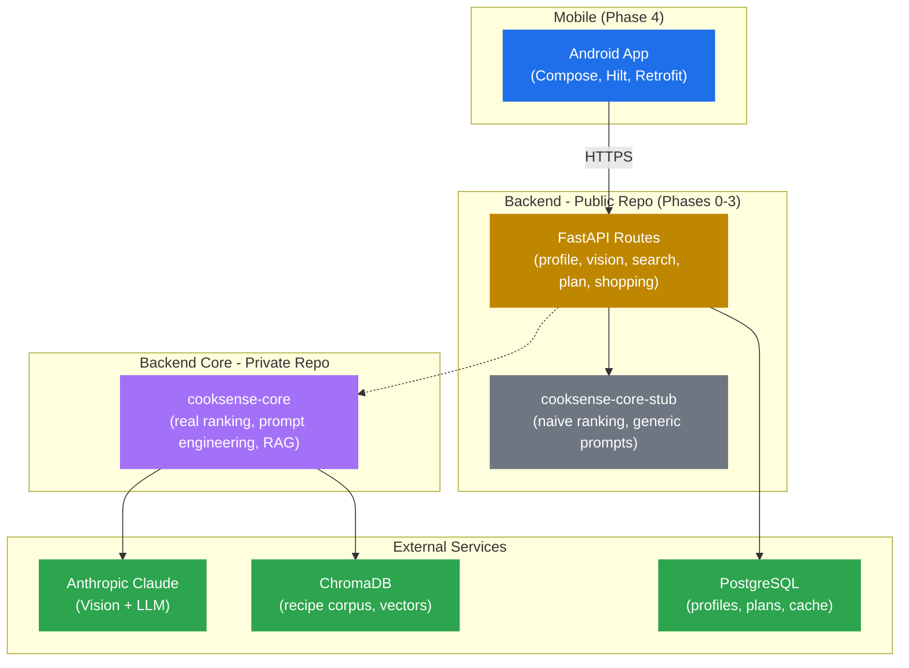

# Phase 5 Spec — Polish, Deployment, Internal Testing Release

**Repo:** `cooksense` (public) + `cooksense-core` (private)
**Domain:** Final portfolio deliverable
**Stack:** GitHub Actions, Fly.io, Google Play Console, Markdown
**Approach:** Mostly content + tooling + deploy. Granular commits, feature branch + PR.
**Branch:** `phase-5-polish`

---

## 1. Goal of Phase 5

The polish phase. No new features, no new tests on top of Phase 4. The output is a portfolio-ready repo plus a working Internal Testing release on Google Play. After Phase 5, a recruiter or Upwork client can:

1. Land on the public repo, understand the architecture in 60 seconds via the README
2. Click a link to install the app on their Android device via Internal Testing
3. Hit the deployed backend without setup
4. Watch a demo video showing the end-to-end flow
5. Read "Why this design" and understand senior-level decisions

At the end of Phase 5:
- Backend deployed to Fly.io with environment secrets configured
- Android APK signed and uploaded to Google Play Internal Testing
- README rewritten for portfolio audience: hook, architecture diagram (Mermaid), tech stack, "Why this design"
- Demo video (60-90 seconds) recorded and linked
- LICENSE finalized at repo root
- CI workflows finalized: build/test on every PR, deploy backend on merge to main
- Build status badge on README
- All Phase 0-4 code untouched

---

## 2. Solution & Folder Structure

```
cooksense/
├── .github/
│   └── workflows/
│       ├── backend-ci.yml                    (extended: add deploy job)
│       ├── android-ci.yml                    (extended: add APK upload job)
│       └── deploy-backend.yml                (NEW, manual trigger)
├── android/                                  (unchanged from Phase 4)
├── backend/
│   ├── Dockerfile                            (NEW)
│   ├── fly.toml                              (NEW)
│   └── .env.production.example               (NEW)
├── docs/
│   ├── phase-0-spec.md                       (unchanged)
│   ├── phase-1-spec.md                       (unchanged)
│   ├── phase-2-spec.md                       (unchanged)
│   ├── phase-3-spec.md                       (unchanged)
│   ├── phase-4-spec.md                       (unchanged)
│   └── phase-5-spec.md                       (NEW, this file)
├── LICENSE                                   (unchanged)
├── README.md                                 (REPLACED with portfolio version)
└── .gitignore                                (unchanged)
```

No source code in `src/`, `tests/`, or any sub-project changes. Phase 5 touches `backend/` for Dockerfile + fly.toml, `.github/workflows/` for deploy automation, `README.md`, and `docs/`.

---

## 3. Backend Deployment to Fly.io

### 3.1 `backend/Dockerfile`

```dockerfile
FROM python:3.12-slim

WORKDIR /app

# System dependencies for chromadb and pillow (image processing)
RUN apt-get update && apt-get install -y --no-install-recommends \
    build-essential \
    libpq-dev \
    libgl1 \
    libglib2.0-0 \
    && rm -rf /var/lib/apt/lists/*

# Copy dependencies first for layer caching
COPY pyproject.toml ./
RUN pip install --no-cache-dir -e ".[stub]"

# Copy source
COPY api/ ./api/
COPY infrastructure/ ./infrastructure/
COPY stub/ ./stub/

# Run as non-root
RUN useradd --create-home --shell /bin/bash cooksense
USER cooksense

EXPOSE 8000

CMD ["uvicorn", "api.main:app", "--host", "0.0.0.0", "--port", "8000"]
```

### 3.2 `backend/fly.toml`

```toml
app = "cooksense-backend"
primary_region = "scl"  # Santiago de Chile, closest to Buenos Aires

[build]
  dockerfile = "Dockerfile"

[env]
  PORT = "8000"
  LOG_LEVEL = "INFO"
  CHROMA_PERSIST_DIR = "/app/data/.chroma"

[http_service]
  internal_port = 8000
  force_https = true
  auto_stop_machines = "stop"  # Free tier: stop when idle
  auto_start_machines = true
  min_machines_running = 0
  processes = ["app"]

[[http_service.checks]]
  interval = "30s"
  timeout = "5s"
  grace_period = "10s"
  method = "GET"
  path = "/api/healthz"

[[mounts]]
  source = "cooksense_data"
  destination = "/app/data"
  initial_size = "1gb"

[[vm]]
  cpu_kind = "shared"
  cpus = 1
  memory_mb = 512
```

### 3.3 Secret management

Secrets set via `fly secrets set` CLI (NOT in `fly.toml`):

```bash
fly secrets set ANTHROPIC_API_KEY=sk-ant-...
fly secrets set DATABASE_URL=postgres://...
fly secrets set CHROMA_HOST=https://...  # Optional; if empty, uses embedded
fly secrets set CHROMA_API_KEY=...
```

The `fly secrets` are env vars at runtime. The app reads them via `pydantic_settings.BaseSettings`.

### 3.4 Database migration on first deploy

PostgreSQL on Fly.io free tier (250MB shared volume). One-time setup:

```bash
fly postgres create --name cooksense-db --region scl
fly postgres attach cooksense-db --app cooksense-backend
```

Tables are created via `Base.metadata.create_all` on app startup (Phase 1 design). For first deploy, this runs once and the schema is in place.

### 3.5 Recipe corpus ingestion (one-time)

The recipe corpus must be ingested into ChromaDB before the backend serves real searches. Two options:

**Option A: Pre-ingested ChromaDB volume.**
Run ingestion locally against ChromaDB embedded mode, ZIP the resulting `.chroma/` directory, upload to Fly volume on first deploy. Avoids cost and time of re-ingestion in production.

**Option B: ChromaDB Cloud free tier.**
Sign up for ChromaDB Cloud (1 GB free), set `CHROMA_HOST` to the cloud endpoint, ingest from a local script that points to the cloud instance.

**Decision: Option B.** ChromaDB Cloud is simpler operationally:
- Decouples DB lifecycle from app deployments
- One-time ingestion script run from local machine
- App connects via HTTP, no volume management

The ingestion script is documented in `backend/README.md`. It's a manual step done once before the app is publicly available.

### 3.6 Decisions

- **Fly.io over Railway/Render:** Fly's free tier includes 3 shared VMs and persistent volumes. Railway changed pricing recently; Render free tier is too restrictive for stateful apps.
- **Region: SCL (Santiago).** Closest Fly region to Argentina. Latency from Buenos Aires ~50ms vs. ~150ms to US East.
- **Auto-stop machines.** App sleeps when idle, wakes on first request. Cold start ~2s, acceptable for portfolio. Saves resource hours on free tier.
- **No CDN.** Backend is internal; mobile app talks directly. CDN is overkill.
- **No staging environment.** Single production deployment. PR previews not enabled (would require additional Fly apps). Reviewer-friendly for portfolio scope.

---

## 4. Android Internal Testing Release

### 4.1 Google Play Console setup (one-time)

1. Create developer account: USD 25 one-time fee
2. Create app: "CookSense" in Google Play Console
3. Configure store listing: name, short description, screenshots, app icon (use a simple chef-hat-with-AI-sparkle icon, generated or hand-made)
4. Configure Internal Testing track:
   - Add test users by email (you + a few testers)
   - Generate opt-in URL to share

### 4.2 APK signing

Generate a release keystore once:

```bash
cd android
keytool -genkey -v -keystore cooksense-release.jks \
  -keyalg RSA -keysize 2048 -validity 10000 -alias cooksense
```

Store the keystore securely. **Do not commit it.** Add to `.gitignore`:

```
android/*.jks
android/*.keystore
```

Configure signing in `app/build.gradle.kts`:

```kotlin
android {
    signingConfigs {
        create("release") {
            storeFile = file("../cooksense-release.jks")
            storePassword = System.getenv("KEYSTORE_PASSWORD") ?: ""
            keyAlias = "cooksense"
            keyPassword = System.getenv("KEY_PASSWORD") ?: ""
        }
    }

    buildTypes {
        release {
            isMinifyEnabled = true
            proguardFiles(
                getDefaultProguardFile("proguard-android-optimize.txt"),
                "proguard-rules.pro"
            )
            signingConfig = signingConfigs.getByName("release")
            buildConfigField("String", "BACKEND_URL", "\"https://cooksense-backend.fly.dev\"")
        }
        debug {
            buildConfigField("String", "BACKEND_URL", "\"http://10.0.2.2:8000\"")
        }
    }
}
```

Keystore password and key password set via environment variables (locally and in GitHub Actions).

### 4.3 Build and upload flow

Manual flow for Phase 5 release:

```bash
# Local
cd android
./gradlew bundleRelease  # Generates AAB (preferred over APK for Play)

# Resulting file: app/build/outputs/bundle/release/app-release.aab
```

Upload AAB to Google Play Console:
- Internal Testing track -> Create new release
- Upload `app-release.aab`
- Review and roll out

Testers receive notification, install via Play Store with their tester account.

### 4.4 GitHub Actions: APK build artifact

Phase 0's `android-ci.yml` already uploads debug APK as workflow artifact. For Phase 5, no automated production upload (Phase 5 keeps signing keys local for security; automated upload would require encrypting and storing the keystore in GitHub Secrets, which is justifiable for a real product but overkill for portfolio).

The release upload is manual. CI continues building debug APK as artifact for any reviewer who wants to side-load.

### 4.5 Decisions

- **Internal Testing track, not Closed/Open Testing or Production.** Internal Testing has no review by Google, no ratings, no review queue. Perfect for portfolio + selective demos.
- **Manual release upload.** Automation requires storing signing keys in GitHub Secrets. Phase 5 prioritizes security over automation. CI/CD for releases is V2.
- **AAB over APK.** Google Play prefers Android App Bundles. Smaller download size, dynamic delivery. Standard since 2021.
- **R8 minification enabled.** Smaller APK. Phase 5 verifies no R8 issues with the dependencies (Compose, Hilt, Retrofit, kotlinx-serialization all work fine with R8 by default; serialization needs `proguard-rules.pro` rules, which are included by the kotlinx plugin).

---

## 5. README Rewrite (Portfolio Version)

### 5.1 New README structure

```markdown
# CookSense

[](https://github.com/jnvallejos/cooksense/actions/workflows/backend-ci.yml)
[](https://github.com/jnvallejos/cooksense/actions/workflows/android-ci.yml)

[Hook paragraph: 3-4 sentences describing the product, what it demonstrates, why it matters]

[Demo video link or embedded preview]

[Internal Testing install link]

## What this demonstrates

[5-7 bullets covering Mobile + AI integration, Open Core architecture, TDD, etc.]

## Architecture

[Mermaid diagram showing Mobile -> Backend -> Core/Stub -> External services]

## Tech stack

### Mobile
- Kotlin 1.9+, Jetpack Compose, Material 3
- Hilt (DI), Retrofit (HTTP), CameraX, DataStore (persistence)
- Coroutines + Flow, ViewModel + StateFlow
- JUnit5 + Turbine + MockK + MockWebServer (testing)

### Backend (public)
- Python 3.12, FastAPI, Pydantic v2
- pytest, ruff
- ChromaDB (vector search), PostgreSQL (profiles + cache)

### Backend core (private repo, proprietary)
- LangChain, Anthropic Claude SDK
- Custom ranking, prompt engineering, retrieval strategies

### Infrastructure
- Fly.io (backend hosting), Google Play Internal Testing (Android distribution)
- GitHub Actions CI/CD

## Quick start

[Three commands to clone, install, test backend]
[Three commands to build and install Android debug APK]

## HTTP endpoints

[Table from Phase 4 README, kept]

## Why this design

### Open Core for IP protection
[Paragraph explaining the public repo / private repo split]

### Mobile + Python backend
[Paragraph: why Python instead of Node/Go, why Compose instead of React Native]

### TDD across two stacks
[Paragraph: TDD discipline visible in commit log on both Python and Kotlin sides]

### Anonymous users V1
[Paragraph: why no auth, what the trade-off costs and saves]

### Profile-driven personalization
[Paragraph: how the proprietary core adds value over a generic recipe app]

### Bilingual at the data layer
[Paragraph: why Spanish translation is pre-computed, not on-the-fly]

### Pragmatic AI cost management
[Paragraph: hash caching, rate limits, stub fallback]

## Test coverage

- Backend: 130+ tests (unit + integration with ephemeral ChromaDB and SQLite)
- Android: 100+ tests (ViewModels, use cases, repositories with MockWebServer)

## License

MIT for the public repo. The `cooksense-core` private repo is proprietary.

## Roadmap

- V2: real authentication, multi-device sync, iOS app, social features
- This V1 ships the core experience: photo -> ingredients -> recipes -> meal plan -> shopping list
```

### 5.2 Mermaid architecture diagram



### 5.3 Hook paragraph (final wording)

```
CookSense turns a photo of your pantry into a 3-day meal plan with shopping list,
personalized to how you cook. Built end-to-end as a portfolio piece in .NET 9's
sibling stack: Python FastAPI backend with Anthropic Claude vision and RAG, Android
Compose mobile client. The architecture deliberately separates open code (mobile,
backend shell, RAG plumbing) from proprietary product logic (ranking, prompts,
retrieval) via an Open Core pattern. Every behavior on both stacks is driven by
tests; the dependency on AI is honest about its cost and cached aggressively.
```

The third sentence flags the Open Core to anyone skimming. The fourth signals senior thinking on cost.

### 5.4 "Why this design" detailed sections

Each section is one paragraph (4-6 lines), addressing the choice and the trade-off explicitly. Reviewers should see "I considered X, chose Y because Z, accept the trade-off W."

---

## 6. CI Workflow Finalization

### 6.1 `backend-ci.yml` extended

Add a deploy job that runs on push to main (after build/test passes):

```yaml
name: Backend CI

on:
  push:
    branches: [main]
    paths: ["backend/**", ".github/workflows/backend-ci.yml"]
  pull_request:
    branches: [main]
    paths: ["backend/**", ".github/workflows/backend-ci.yml"]

jobs:
  build-and-test:
    # ... (existing from Phase 0, unchanged)

  deploy:
    name: Deploy to Fly.io
    needs: build-and-test
    runs-on: ubuntu-latest
    if: github.event_name == 'push' && github.ref == 'refs/heads/main'

    steps:
      - name: Checkout
        uses: actions/checkout@v4

      - name: Setup Fly CLI
        uses: superfly/flyctl-actions/setup-flyctl@master

      - name: Deploy backend
        run: flyctl deploy --remote-only --config backend/fly.toml --dockerfile backend/Dockerfile
        env:
          FLY_API_TOKEN: ${{ secrets.FLY_API_TOKEN }}
        working-directory: ./backend
```

`FLY_API_TOKEN` is set as a GitHub Secret. Generated via `fly auth token`.

### 6.2 `android-ci.yml` finalization

Phase 0's CI already builds debug APK on every push. Phase 5 adds:
- Run tests on every PR (already there)
- Lint with ktlint and detekt (already there)
- Upload debug APK artifact (already there)

No production release automation in Phase 5 (signing keys stay local).

### 6.3 Build status badge

Top of README:

```markdown
[](https://github.com/jnvallejos/cooksense/actions/workflows/backend-ci.yml)
[](https://github.com/jnvallejos/cooksense/actions/workflows/android-ci.yml)
```

Two badges, one per workflow. Both green = repo is healthy.

---

## 7. Demo Video

### 7.1 Content (60-90 seconds)

Storyboard:

1. **0:00-0:05** — App icon, "CookSense" title card
2. **0:05-0:15** — Open app on phone, scrolling Home, tap "Quick Recipe"
3. **0:15-0:25** — Camera opens, tap capture, ingredient detection appears with chips
4. **0:25-0:35** — Tap "Find recipes", recipe list appears, scroll, tap a card
5. **0:35-0:50** — Recipe detail with full info, tap "Ask a question", type "Can I substitute X?", answer appears
6. **0:50-1:05** — Back to Home, tap "Plan 3 Days", same camera flow, meal plan appears
7. **1:05-1:20** — Swipe through 3 days, tap "Shopping list", grouped items shown
8. **1:20-1:30** — End card with GitHub URL, "MIT licensed, see repo for code"

### 7.2 Production

- Record with phone screen recording (built-in on Android)
- Edit lightly (cuts only, no music, no narration in V1) — minimal post-production
- Export at 720p, embed in README via GitHub-supported video link or YouTube unlisted upload

### 7.3 Decisions

- **No narration.** Subtitles or just clean visuals. Easier to produce, accessible, doesn't lock to one language.
- **Real flow, not staged.** Use the actual deployed backend with real Claude calls. Demonstrates the cooksense-core working.
- **One take per scene.** Don't over-polish. Authentic > slick.
- **Hosted on GitHub or YouTube.** GitHub direct video embed has size limits (~10MB); YouTube unlisted is more reliable.

---

## 8. Documentation Updates

### 8.1 `backend/README.md`

Replace the development-only README with a production-aware version:

- Local dev setup
- Production env vars
- ChromaDB ingestion guide (one-time)
- How to deploy to Fly.io (manual + automated)
- How to debug logs (`fly logs`)

### 8.2 `android/README.md` (NEW)

Brief README for the Android sub-project:

- Build instructions (debug + release)
- How to point at local vs. production backend
- Internal Testing release flow

### 8.3 `cooksense-core` README.md

Update the private repo README:

- Why it's private (IP protection)
- How it pairs with the public stub
- Installation in the public backend's `pyproject.toml`
- Internal architecture (ranking, prompts, retrieval)
- How to run private tests
- Note: this repo is not for distribution

---

## 9. LICENSE Finalization

### 9.1 Public repo `LICENSE`

Standard MIT license (already in place from Phase 0). Verify:
- Copyright year: 2026
- Copyright holder: "Javier Vallejos"
- Verbatim MIT text

### 9.2 Private repo `LICENSE`

```
Copyright (c) 2026 Javier Vallejos. All Rights Reserved.

This software and associated documentation files (the "Software") are the
proprietary and confidential property of Javier Vallejos. Unauthorized
copying, distribution, modification, public display, or public performance
of this Software is strictly prohibited.

The Software is intended for use only in connection with the CookSense
product. No license, express or implied, is granted to any party for any
other purpose.
```

(Same as Phase 0; verify wording.)

---

## 10. Test Strategy — Phase 5

Phase 5 adds zero unit tests. The existing 230+ tests across backend and Android are unchanged.

What Phase 5 verifies operationally:

- Backend deploys successfully to Fly.io
- `/api/healthz` returns 200 against the deployed URL
- One smoke test against deployed backend (curl from local machine):
  - `curl https://cooksense-backend.fly.dev/api/healthz`
  - `curl -X POST https://cooksense-backend.fly.dev/api/profile -H "X-User-Id: smoke" -H "Content-Type: application/json" -d '{"cooking_for":"self","household_size":1,"dietary_restrictions":[],"fitness_goal":"none","cooking_skill":"beginner","time_budget_minutes":30,"language":"en"}'`
  - Verifies endpoint reachable, returns 201
- Android APK builds and installs in Internal Testing
- Demo flow walks through end-to-end without crash on at least one device

These are manual verifications, not automated. Phase 5 is "release verification" not "test addition."

---

## 11. Commit Convention — Phase 5

Granular commits, ~12-18 expected for Phase 5. Examples:

```
chore(infra): add backend Dockerfile for fly.io
chore(infra): add fly.toml configuration for SCL region
docs(infra): document deployment process in backend README
chore(ci): add deploy job to backend CI workflow
chore(android): configure release signing in build.gradle
chore(android): enable R8 minification for release builds
docs(android): add Android sub-project README
chore(repo): add Mermaid architecture diagram to README
docs(repo): rewrite README hook paragraph and tech stack section
docs(repo): add "Why this design" section with 7 explanations
docs(repo): add CI build status badges to README
docs(repo): add demo video link to README
chore(repo): add Phase 5 progress note
docs: add Phase 5 spec to docs folder
docs(core): update cooksense-core README with V1 design rationale
chore(repo): finalize LICENSE for both repos
```

~15 commits expected. Lower than other phases because most work is content + config, not code.

---

## 12. What NOT to Do in Phase 5

- **Do not** add new features. V1 is V1.
- **Do not** add new tests. Existing coverage is sufficient.
- **Do not** modify Phase 0-4 source code (backend or Android).
- **Do not** add a staging environment. Single production.
- **Do not** automate signing key storage in GitHub Secrets. Keep local for V1.
- **Do not** add marketing pages, landing site, or Vercel deploy for documentation.
- **Do not** add waitlist signup, email capture, or any user acquisition tooling.
- **Do not** add Open Testing or Production track on Google Play. Internal only.
- **Do not** add AdMob, in-app purchases, paywall, or any monetization. V1 is free.
- **Do not** add iOS yet. V2 (Phase 6).
- **Do not** add multi-region Fly.io deployment. Single region SCL.
- **Do not** add dependencies beyond what's already in pyproject.toml and build.gradle.
- **Do not** add Sentry, Crashlytics, or any production monitoring. V1 ships and watches `fly logs` manually.
- **Do not** add CDN, image optimization, or static asset hosting. No images served by backend.
- **Do not** add load balancing, scaling rules. Free tier scales to zero on idle.
- **Do not** add custom domain (cooksense.app, etc.). Use Fly.io's `*.fly.dev` subdomain.
- **Do not** add status page, uptime monitor. Free tier reliability is best-effort.
- **Do not** add NPM, Node, or any JS tooling.

---

## 13. Acceptance Criteria for Phase 5 Completion

Pre-merge:

- [ ] `backend/Dockerfile` exists and builds locally (`docker build -t cooksense-backend .`)
- [ ] `backend/fly.toml` exists with correct app name, region, mounts
- [ ] `.github/workflows/backend-ci.yml` extended with deploy job (gated by main branch + push event)
- [ ] `.github/workflows/android-ci.yml` finalized (build + test + APK artifact)
- [ ] Build status badges visible on README first line
- [ ] README rewritten with portfolio structure: hook, demo, architecture, tech stack, why this design
- [ ] Mermaid architecture diagram renders correctly (verify in PR preview)
- [ ] "Why this design" section has 7 paragraphs covering Open Core, mobile+Python, TDD, anonymous users, personalization, bilingual, AI cost
- [ ] Demo video link included (or placeholder if filming pending)
- [ ] `backend/README.md` updated with production deployment instructions
- [ ] `android/README.md` created
- [ ] `docs/phase-5-spec.md` committed
- [ ] LICENSE verified (MIT, 2026, Javier Vallejos)
- [ ] Phase 0-4 source code unchanged (`git diff main..phase-5-polish -- src/ tests/ android/app/src/` returns minimal expected changes)
- [ ] PR opened on `phase-5-polish` against `main`, NOT merged

Post-merge:

- [ ] Backend deployed to Fly.io, `/api/healthz` returns 200
- [ ] One end-to-end smoke test from a real device against deployed backend passes
- [ ] Android APK signed (release build), uploaded to Google Play Internal Testing
- [ ] Internal Testing opt-in URL works (tester can install)
- [ ] Demo video recorded, uploaded, linked in README
- [ ] Both CI badges show green status
- [ ] Repo public on GitHub at `github.com/jnvallejos/cooksense`

---

## 14. Branch & PR Workflow — Phase 5

1. `git checkout -b phase-5-polish` from `main`
2. Commit on branch following Section 11
3. `git push -u origin phase-5-polish`
4. `gh pr create --base main --head phase-5-polish --title "Phase 5: Polish & Release"`
5. PR body: summary + acceptance criteria + screenshots/video link
6. NOT merge.
7. Report and stop.
8. Post-merge: deploy backend manually, build/sign/upload AAB to Internal Testing, record demo video.

---

## 15. After Phase 5 — Project Status

CookSense V1 is shipped. The repo serves its portfolio purpose:

- Mobile + AI integration end-to-end
- Open Core architecture demonstrated
- TDD discipline across two stacks
- Production deployment (Fly.io + Internal Testing)
- Defensible in interview with concrete decisions

What remains, in priority order:

1. **Filming the demo video** (post-merge, can be done same week)
2. **Sharing the Internal Testing link** with first reviewers (Upwork pitches, network)
3. **Phase 6 (iOS app)** if Apple Developer Program purchase makes sense at that point

Phase 6 is a separate planning conversation, not auto-scoped here. The V1 deliverable is complete after Phase 5 merges.

---

## 16. Out of scope (V2+)

Documented for clarity, NOT included in any V1 phase:

- iOS app (Phase 6 if pursued)
- Real authentication (email/password, Google sign-in)
- Multi-device sync
- Recipe favorites and history (per-user persistent across reinstalls)
- Social features (sharing recipes, follow chefs)
- Voice input
- Multi-photo per session
- Custom recipes by user
- Real-time macro tracking
- Integration with grocery delivery services
- Subscription / paywall
- Push notifications
- Dark mode override
- Wearable companion (Wear OS, Apple Watch)
- Cooking timer / step-by-step active mode
- Offline RAG (recipe corpus on-device)

Each of these is V2/V3 territory. The V1 scope is what Phases 0-5 deliver.
